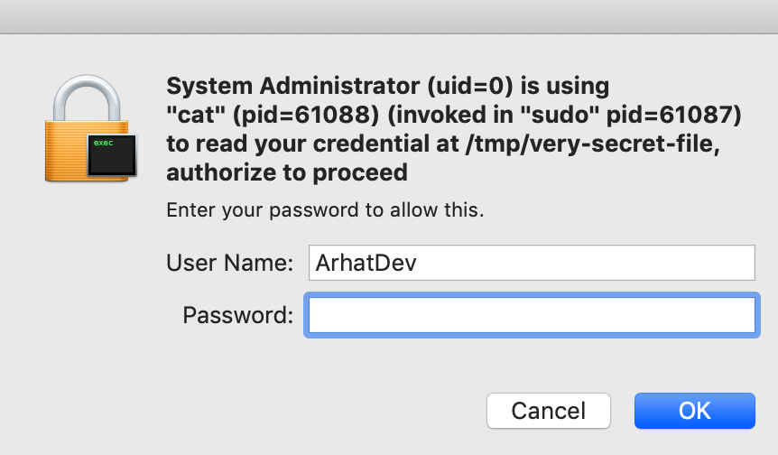

# CredentialFS

[](https://github.com/arhat-dev/credentialfs/actions?query=workflow%3ACI)
[](https://github.com/arhat-dev/credentialfs/actions?query=workflow%3ABuild)
[](https://pkg.go.dev/arhat.dev/credentialfs)
[](https://goreportcard.com/report/arhat.dev/credentialfs)
[](https://codecov.io/gh/arhat-dev/credentialfs)

Userspace filesystem daemon for credentials stored in password managers

<p align="center"></p>

## Why this project?

Say you are using password manager (abbrv. `pm`) for your own credential management, but you always have to store some of the credentials locally for apps without the support for reading from system keychain (e.g. `rclone`, `kubectl`), that can be risky once you have your computer hacked and the hacker can read these local credentials without your permit.

One solution is to develop a plugin or a wrapper script for these apps to read from system keychain, so you can store these credentials locally and safely.

Another solution is to mount a custom filesystem, which integrates with your password manager, and doesn't store credentials to local disk, everytime there is a file read operation to your credential files, the filesystem daemon will request explicit user authorization using system security feature to allow or deny the read operation.

## Suitable Use Cases

- Sync credential files among your working computers with online password manager
- Store credentials directly in config files (e.g. kubeconfig using client certificate for authentication)
  - Then you can manage your home directory using a private git repo safely
- Authorized automation: store passwords in files (e.g. ssh password)
  - Then you can `cat /path/to/password` in your automation scripts, and run your scripts after authorization process.

## How it works?

- Firstly it will sync credentials from your password managers, keep those required (as configured in the config file) in memory.
- Then it will start a FUSE server, with all your credentials mounted in a single directory, symlink them to their target paths.
- When there is a `open()` request to your credential, it will prompt an authorization dialog with caller's `User Name + uid`, `Process Name + pid`, `Parent Process Name + ppid` through system's security api.
  - The authorization request decision is made based on the value of `sha256sum(uid + "|" + pid + "|" + ppid + "|" + path)`
    - __NOTE:__ To reduce uncessary authorization for command line users, `pid` here is the executable name (if we can determine).
- The mounted credentials (files) can only be read by the `open()` caller after a successful authorization.
  - You can configure how long a successful authorization will last to avoid frequent interruptions.

## Features

- [x] Mount your credentials as in memory files for authorized automation
- [x] Continuous syncing with your own password manager
- [ ] Encrypted in memory credential cache (see [issue#4](https://github.com/arhat-dev/credentialfs/issues/4))

## Support Matrix

- Authorization Service
  - OS Native
    - [x] `macos` (requires [`osxfuse`](https://github.com/osxfuse/osxfuse))
    - [ ] `windows` (TODO)
    - [ ] `linux` (TODO)
  - External Device (TODO)
  - External Network Service (TODO)
    - [ ] `webauthn` (`fido2`)
- Password Managers
  - [x] [`bitwarden`](./docs/pm/bitwarden.md)
  - [ ] `1password` (TODO)
  - [ ] `keepass` (TODO)
- Login Method
  - [x] Simple username + password
  - 2FA (TODO)
    - [ ] username + password + one time password
    - [ ] username + password + U2F
  - Passwordless (TODO)

## Config

Create a yaml config file like this:

```yaml
app:
  log:
  - level: verbose
    file: stderr

  # use system authorization service
  authService:
    name: system

  # use system keychain service
  keychainService:
    name: system

fs:
  # global mountpoint, all your credentials will be mounted to this
  # directory, you can find all files listed in `fs.spec[*].mounts.from`
  # in this directory, however their names are hex encoded string of
  # sha256 hash of `fs.spec[*].mounts.to`
  #
  # leave it empty to use random temporary dir for mountpoint
  mountpoint: ""

  # show fuse debug log output
  debug: false

  # choose login interface
  # currently only supports `cli`
  loginInterface: cli

  # NOTE: the authorization is process specific as noted in `How it works?`
  #       their penalty & permit durations are timed individually

  # duration to always deny access after authorization failed
  defaultPenaltyDuration: 10s

  # duration to always allow access after authorization succeeded
  #
  # defaults to 0, which means always request authorization
  defaultPermitDuration: 0s

  # filesystem spec
  # list of password managers and their file mounts
  spec:
  - pm:
      # (required) unique name (among all local credentialfs config) of this password manager config
      name: my-pm
      # (required) currently only supports `bitwarden`
      driver: bitwarden
      # please read ./docs/pm/{driver}.md for config reference
      config: {}
    # mount credentials as files from the password manager above
    #
    # NOTE: The mount operation here actually creates symlinks for your
    #       `mounts[*].to` since we haven't found a reasonabley easy way
    #       to support file bind mount on all platforms, please let us
    #       know by creating a new issue if you have a good idea.
    mounts:
    - from: <Item Name>/<Item Key>
      # local mount path
      to: ${HOME}/.ssh/joe.doyle

      # override defaultPenaltyDuration
      penaltyDuration: 5s

      # override defaultPermitDuration
      permitDuration: 5s
```

## Build and Install

Clonse this repo and run `make credentialfs` in the repo root, you can find built executable at `./build/credentialfs`, move it to somewhere you can access.

Or you can install it to `${GOPATH}/bin/credentialfs` using following command directly:

```bash
CGO_ENABLED=1 GOOS=$(go env GOHOSTOS) GOARCH=$(go env GOHOSTARCH) \
  go get arhat.dev/credentialfs/cmd/credentialfs
```

## Run

```bash
/path/to/credentialfs
```

By default, it will read your config file at `${HOME}/.config/credentiafs/config.yaml`, you can also specify your custom config file with `-c /path/to/your/config`

## LICENSE

```text
Copyright 2020 The arhat.dev Authors.

Licensed under the Apache License, Version 2.0 (the "License");
you may not use this file except in compliance with the License.
You may obtain a copy of the License at

    http://www.apache.org/licenses/LICENSE-2.0

Unless required by applicable law or agreed to in writing, software
distributed under the License is distributed on an "AS IS" BASIS,
WITHOUT WARRANTIES OR CONDITIONS OF ANY KIND, either express or implied.
See the License for the specific language governing permissions and
limitations under the License.
```
